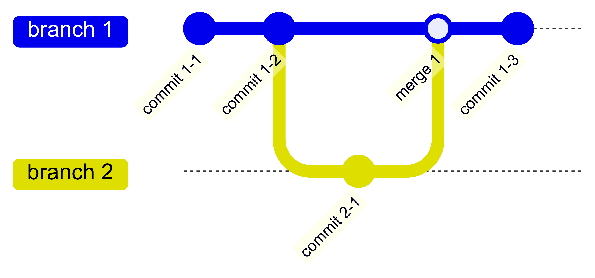
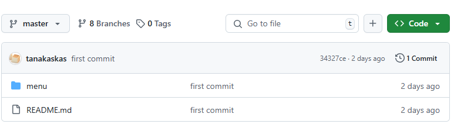
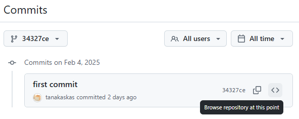
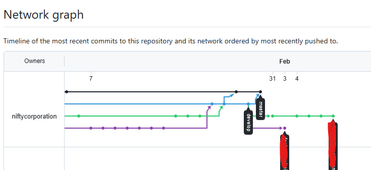
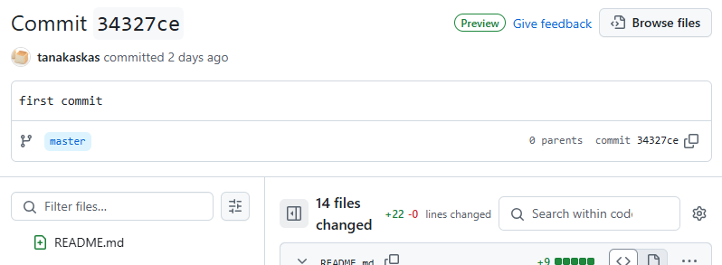
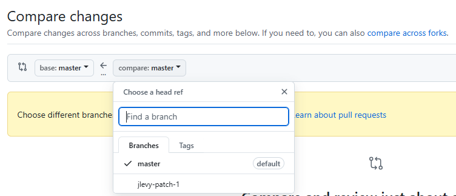
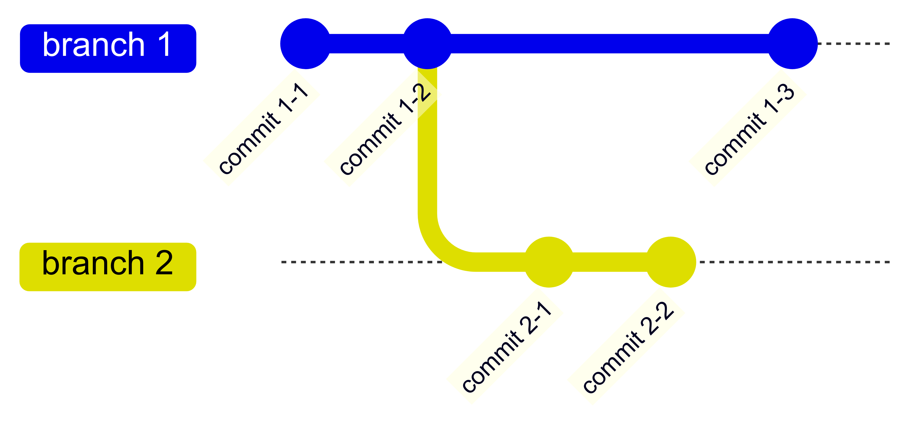

<h1 align="center">:lollipop: Escape From a Sweets Shop :lollipop:</h1>

## プロローグ

「あるお菓子屋さんからの脱出」へようこそ

ここはエンジニアの店主が切り盛りするお菓子屋さん

あなたはお客さんとして入店しましたが、一番人気の商品が何か当てるまでお店を出ることができません

エンジニアの店主は、このGitリポジトリに人気商品についての秘密を隠しました

リポジトリに潜む全ての謎を解き明かし、一番人気の商品が何かを当てよう！

```
まずはリポジトリを最初のcommitの状態にして、README.mdに目を通そう
```

## Gitの説明
### Gitとは
Gitとは、ファイルやフォルダのスナップショットを保存することで変更履歴を管理するシステムです

### 用語集
- commit
  - 変更履歴1つ分をコミットと呼びます
  - コミットには一意のハッシュ値が割り当てられます
- branch
  - 変更履歴を枝分かれさせて、様々なバージョンを管理することができます。それぞれの分岐をブランチと呼びます。
- merge
  - ブランチとブランチを統合させることをマージと呼びます



### GitHubで使える便利な機能
#### 特定のコミット時点のリポジトリを閲覧
##### コミット一覧から選択する方法
1. ファイル一覧の上部にあるコミット数をクリックし、コミット一覧を表示させます  

1. `<>`をクリックすると、そのコミット時点でのリポジトリが表示されます  


##### ブランチのグラフから選択する方法
1. Insightsタブを開きます
1. Networkを選択します
1. グラフが表示されたら、対象のコミットを表す丸印をクリックします  

1. コミットの詳細が表示されたら、`Browse files`をクリックすると、そのコミット時点でのリポジトリが表示されます  


#### 特定のコミットやブランチ間の差分を比較
1. 比較対象のコミットのハッシュ値 or ブランチ名を確認します
1. https://github.com/tanakaskas/escape-from-a-sweets-shop/compare を開きます
1. 比較対象を入力します
    - UIから操作する場合はプルダウンからブランチを選びます  

    - コミットを比較する場合や、URLで操作する場合は比較対象を`.`で繋いで入力します
        - 例: `https://github.com/tanakaskas/escape-from-a-sweets-shop/compare/${ハッシュ値1}...${ハッシュ値2}`

##### Two dot diff と Tree dot diff
差分の確認方法には、Two dotとThree dotの2種類があります

Two dot diff (例: branch1..branch2) では、比較するブランチの最新のコミット同士が比較されます

例えば、このようなブランチの構造になっているとします  


Two dot diff では、 `commit 1-3` と `commit 2-2` が比較されます

一方、 Three dot diff (例: branch1...branch2) では、branch1の祖先と、branch2の最新のコミットが比較されます  
先程と同じブランチの構造だと、 `commit 1-2` （2つのブランチが枝分かれしている祖先）と `commit 2-2` が比較されます

単純にファイル同士の比較がしたい場合は Two dot diff を、  
あるブランチに別のブランチをマージした時に何が変わるか、という観点で比較したい場合は Three dot diff を使います

詳細は [スリードットおよびツードット Git diff での比較](https://docs.github.com/ja/pull-requests/collaborating-with-pull-requests/proposing-changes-to-your-work-with-pull-requests/about-comparing-branches-in-pull-requests#three-dot-and-two-dot-git-diff-comparisons) をご覧ください
